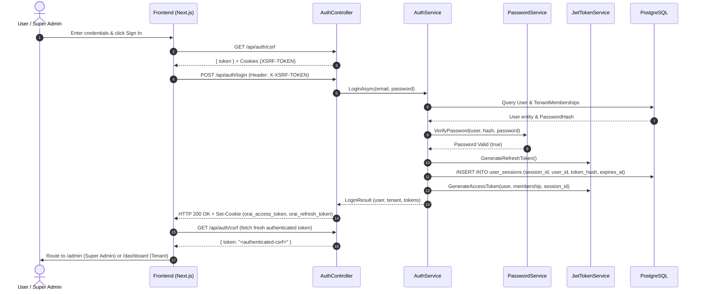
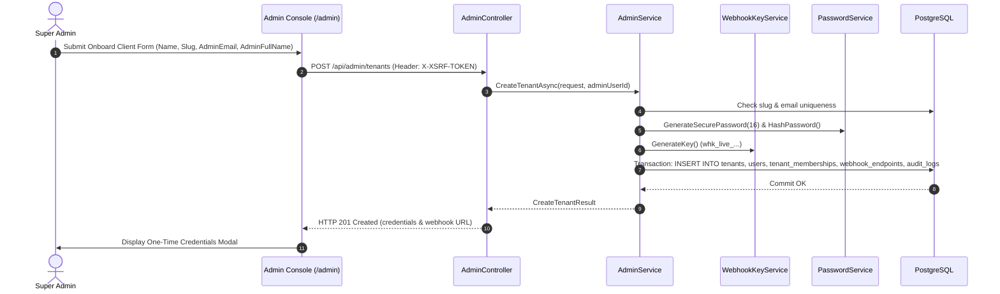
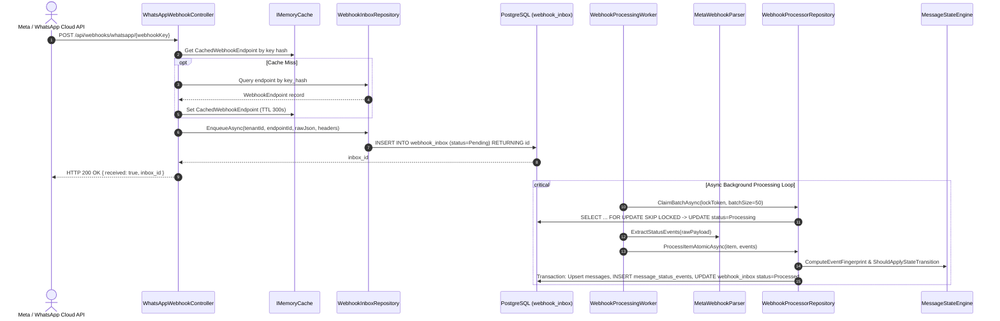
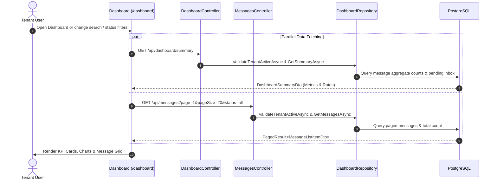
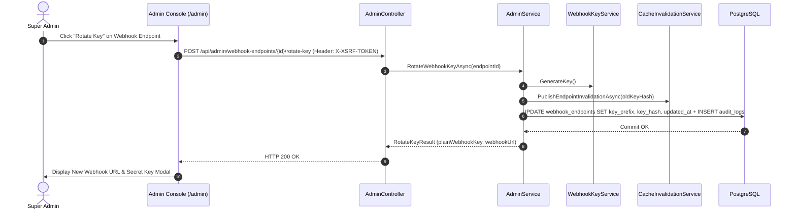

# ORAI Webhook Manager — API Call Flow & Architecture Specification

This document provides an exhaustive, verified audit of all application programming interfaces (APIs), background processes, data flows, and security mechanics across the **ORAI Webhook Manager** repository.

---

## 1. Complete API Inventory

| Feature / Screen | User Action / Trigger | HTTP Method | Exact Endpoint | When It Is Called | Frontend Source File & Function | Backend Controller & Method | Authentication / Role | CSRF Required | Request Body / Parameters | Response | Database Tables & Services Used |
|---|---|---|---|---|---|---|---|---|---|---|---|
| **Antiforgery Protection** | App initialization or pre-flight token refresh | `GET` | `/api/auth/csrf` | Before executing any state-mutating request (login, refresh, mutation) | [`lib/api.ts`](file:///d:/ORAI/ORAI%20PROJECTS/orai-webhook-manager/frontend/src/lib/api.ts#L40) (`fetchCsrfToken`, `ensureCsrfToken`) | [`AuthController.GetCsrfToken`](file:///d:/ORAI/ORAI%20PROJECTS/orai-webhook-manager/backend/src/OraiWebhookManager.Api/Controllers/AuthController.cs#L29) | Anonymous (`[AllowAnonymous]`) | No | None | `{ token: string }` + `XSRF-TOKEN` and `.AspNetCore.Antiforgery` cookies | `IAntiforgery` |
| **Authentication** | User submits email and password on Login page | `POST` | `/api/auth/login` | Login form submission | [`lib/api.ts`](file:///d:/ORAI/ORAI%20PROJECTS/orai-webhook-manager/frontend/src/lib/api.ts#L213) (`loginApi`) via [`app/login/page.tsx`](file:///d:/ORAI/ORAI%20PROJECTS/orai-webhook-manager/frontend/src/app/login/page.tsx#L26) | [`AuthController.Login`](file:///d:/ORAI/ORAI%20PROJECTS/orai-webhook-manager/backend/src/OraiWebhookManager.Api/Controllers/AuthController.cs#L47) | Anonymous (Rate limited: 10/min) | Yes (`[ValidateCsrf]`) | `LoginRequest`: `{ email, password }` | `{ succeeded, user, tenant, mustChangePassword }` + `orai_access_token` & `orai_refresh_token` cookies | `users`, `tenant_memberships`, `tenants`, `user_sessions` via `IAuthService`, `IPasswordService`, `IJwtTokenService` |
| **Authentication** | Automatic session refresh on 401 HTTP response | `POST` | `/api/auth/refresh` | Triggered by HTTP interceptor upon receiving 401 Unauthorized | [`lib/api.ts`](file:///d:/ORAI/ORAI%20PROJECTS/orai-webhook-manager/frontend/src/lib/api.ts#L274) (`refreshApi`, `requestWithRefresh`) | [`AuthController.Refresh`](file:///d:/ORAI/ORAI%20PROJECTS/orai-webhook-manager/backend/src/OraiWebhookManager.Api/Controllers/AuthController.cs#L72) | Anonymous (Cookie-based: `orai_refresh_token`) | Yes (`[ValidateCsrf]`) | None (reads `orai_refresh_token` HttpOnly cookie) | `{ succeeded, user, tenant, mustChangePassword }` + rotated auth cookies | `user_sessions`, `users`, `tenant_memberships`, `tenants` via `IAuthService`, `IJwtTokenService` |
| **Authentication** | User clicks "Sign Out" button | `POST` | `/api/auth/logout` | Header / Navigation Sign Out action | [`lib/api.ts`](file:///d:/ORAI/ORAI%20PROJECTS/orai-webhook-manager/frontend/src/lib/api.ts#L280) (`logoutApi`) via [`Header.tsx`](file:///d:/ORAI/ORAI%20PROJECTS/orai-webhook-manager/frontend/src/components/Header.tsx#L142) | [`AuthController.Logout`](file:///d:/ORAI/ORAI%20PROJECTS/orai-webhook-manager/backend/src/OraiWebhookManager.Api/Controllers/AuthController.cs#L103) | Anonymous (Reads `orai_refresh_token` cookie) | Yes (`[ValidateCsrf]`) | None (reads `orai_refresh_token` HttpOnly cookie) | `{ message: "Logged out successfully" }` + cookie deletion | `user_sessions` via `IAuthService` |
| **User Identity** | Protected layout verification & routing | `GET` | `/api/auth/me` | App load, root navigation, route authorization guards | [`lib/api.ts`](file:///d:/ORAI/ORAI%20PROJECTS/orai-webhook-manager/frontend/src/lib/api.ts#L336) (`getCurrentSessionApi`) via [`ProtectedLayout.tsx`](file:///d:/ORAI/ORAI%20PROJECTS/orai-webhook-manager/frontend/src/components/ProtectedLayout.tsx#L34), [`app/page.tsx`](file:///d:/ORAI/ORAI%20PROJECTS/orai-webhook-manager/frontend/src/app/page.tsx#L14) | [`AuthController.GetCurrentUser`](file:///d:/ORAI/ORAI%20PROJECTS/orai-webhook-manager/backend/src/OraiWebhookManager.Api/Controllers/AuthController.cs#L134) | Authenticated (`[Authorize]`) | No | None | `AuthSessionDto`: `{ user, tenant }` | `users`, `tenant_memberships`, `tenants` via `IAuthService`, `ICurrentUserContext` |
| **Password Setup / Change** | Forced change on first login or manual password update | `POST` | `/api/auth/change-password` | Form submit on `/change-password` page | [`lib/api.ts`](file:///d:/ORAI/ORAI%20PROJECTS/orai-webhook-manager/frontend/src/lib/api.ts#L322) (`changePasswordApi`) via [`app/change-password/page.tsx`](file:///d:/ORAI/ORAI%20PROJECTS/orai-webhook-manager/frontend/src/app/change-password/page.tsx#L40) | [`AuthController.ChangePassword`](file:///d:/ORAI/ORAI%20PROJECTS/orai-webhook-manager/backend/src/OraiWebhookManager.Api/Controllers/AuthController.cs#L113) | Authenticated (`[Authorize]`, Rate limited: 10/min) | Yes (`[ValidateCsrf]`) | `ChangePasswordRequest`: `{ currentPassword, newPassword }` | `{ succeeded: true, message: string }` | `users`, `user_sessions`, `audit_logs` via `IAuthService`, `IPasswordService` |
| **Super Admin Platform** | Super Admin dashboard metrics loading | `GET` | `/api/admin/platform/summary` | Admin panel mount and manual refresh | [`lib/api.ts`](file:///d:/ORAI/ORAI%20PROJECTS/orai-webhook-manager/frontend/src/lib/api.ts#L342) (`getPlatformSummaryApi`) via [`app/admin/page.tsx`](file:///d:/ORAI/ORAI%20PROJECTS/orai-webhook-manager/frontend/src/app/admin/page.tsx#L110) | [`AdminController.GetPlatformSummary`](file:///d:/ORAI/ORAI%20PROJECTS/orai-webhook-manager/backend/src/OraiWebhookManager.Api/Controllers/AdminController.cs#L25) | Role: `PlatformAdmin` (`[Authorize(Policy = "PlatformAdmin")]`) | No | None | `PlatformSummaryDto`: `{ totalTenants, activeTenants, suspendedTenants, totalMessages, failedMessages, pendingInbox, deadLetterInbox }` | `tenants`, `messages`, `webhook_inbox` via `IAdminService` |
| **Super Admin Platform** | Super Admin tenant directory table loading | `GET` | `/api/admin/tenants` | Admin panel mount, search query, status filter, pagination | [`lib/api.ts`](file:///d:/ORAI/ORAI%20PROJECTS/orai-webhook-manager/frontend/src/lib/api.ts#L346) (`getAdminTenantsApi`) via [`app/admin/page.tsx`](file:///d:/ORAI/ORAI%20PROJECTS/orai-webhook-manager/frontend/src/app/admin/page.tsx#L122) | [`AdminController.GetTenants`](file:///d:/ORAI/ORAI%20PROJECTS/orai-webhook-manager/backend/src/OraiWebhookManager.Api/Controllers/AdminController.cs#L32) | Role: `PlatformAdmin` | No | Query: `search`, `isActive`, `page` (default 1), `pageSize` (default 20) | `PagedResult<AdminTenantListItemDto>` | `tenants`, `tenant_memberships`, `users`, `webhook_endpoints`, `messages` via `IAdminService` |
| **Super Admin Platform** | Super Admin views single tenant details modal | `GET` | `/api/admin/tenants/{id}/summary` | Admin clicks "Inspect / View Details" on a tenant row | [`lib/api.ts`](file:///d:/ORAI/ORAI%20PROJECTS/orai-webhook-manager/frontend/src/lib/api.ts#L364) (`getAdminTenantSummaryApi`) via [`app/admin/page.tsx`](file:///d:/ORAI/ORAI%20PROJECTS/orai-webhook-manager/frontend/src/app/admin/page.tsx#L70) | [`AdminController.GetTenantSummary`](file:///d:/ORAI/ORAI%20PROJECTS/orai-webhook-manager/backend/src/OraiWebhookManager.Api/Controllers/AdminController.cs#L45) | Role: `PlatformAdmin` | No | Route param: `id:guid` | `AdminTenantSummaryDto`: `{ id, name, slug, isActive, createdAt, updatedAt, users, endpoints, totalMessages, failedMessages }` | `tenants`, `tenant_memberships`, `users`, `webhook_endpoints`, `messages` via `IAdminService` |
| **Super Admin Platform** | Admin onboards new client tenant | `POST` | `/api/admin/tenants` | Submitting "Onboard Client" modal | [`lib/api.ts`](file:///d:/ORAI/ORAI%20PROJECTS/orai-webhook-manager/frontend/src/lib/api.ts#L370) (`createTenantApi`) via [`app/admin/page.tsx`](file:///d:/ORAI/ORAI%20PROJECTS/orai-webhook-manager/frontend/src/app/admin/page.tsx#L197) | [`AdminController.CreateTenant`](file:///d:/ORAI/ORAI%20PROJECTS/orai-webhook-manager/backend/src/OraiWebhookManager.Api/Controllers/AdminController.cs#L57) | Role: `PlatformAdmin` | Yes (`[ValidateCsrf]`) | `CreateTenantRequest`: `{ name, slug, adminEmail, adminFullName }` | `CreateTenantResult`: `{ tenantId, tenantName, tenantSlug, adminUserId, adminEmail, initialPassword, webhookEndpointId, webhookEndpointName, webhookUrl, plainWebhookKey, keyPrefix }` | `tenants`, `users`, `tenant_memberships`, `webhook_endpoints`, `audit_logs` via `IAdminService`, `IPasswordService`, `IWebhookKeyService` |
| **Super Admin Platform** | Admin activates or suspends a tenant | `PATCH` | `/api/admin/tenants/{id}/status` | Admin clicks "Suspend" or "Activate" on tenant row | [`lib/api.ts`](file:///d:/ORAI/ORAI%20PROJECTS/orai-webhook-manager/frontend/src/lib/api.ts#L380) (`updateTenantStatusApi`) via [`app/admin/page.tsx`](file:///d:/ORAI/ORAI%20PROJECTS/orai-webhook-manager/frontend/src/app/admin/page.tsx#L219) | [`AdminController.UpdateTenantStatus`](file:///d:/ORAI/ORAI%20PROJECTS/orai-webhook-manager/backend/src/OraiWebhookManager.Api/Controllers/AdminController.cs#L79) | Role: `PlatformAdmin` | Yes (`[ValidateCsrf]`) | Route: `id:guid`, Body: `UpdateTenantStatusRequest`: `{ isActive: boolean }` | `{ succeeded: true, message: string }` | `tenants`, `tenant_memberships`, `user_sessions`, `audit_logs` via `IAdminService` |
| **Super Admin Platform** | Admin resets client admin password | `POST` | `/api/admin/tenants/{id}/reset-client-password` | Admin clicks "Reset Password" on tenant row | [`lib/api.ts`](file:///d:/ORAI/ORAI%20PROJECTS/orai-webhook-manager/frontend/src/lib/api.ts#L394) (`resetClientPasswordApi`) via [`app/admin/page.tsx`](file:///d:/ORAI/ORAI%20PROJECTS/orai-webhook-manager/frontend/src/app/admin/page.tsx#L239) | [`AdminController.ResetClientPassword`](file:///d:/ORAI/ORAI%20PROJECTS/orai-webhook-manager/backend/src/OraiWebhookManager.Api/Controllers/AdminController.cs#L98) | Role: `PlatformAdmin` | Yes (`[ValidateCsrf]`) | Route param: `id:guid` | `ResetClientPasswordResult`: `{ userId, email, newTemporaryPassword }` | `tenant_memberships`, `users`, `user_sessions`, `audit_logs` via `IAdminService`, `IPasswordService` |
| **Super Admin Platform** | Admin rotates tenant webhook ingestion key | `POST` | `/api/admin/webhook-endpoints/{id}/rotate-key` | Admin clicks "Rotate Key" in tenant summary modal | [`lib/api.ts`](file:///d:/ORAI/ORAI%20PROJECTS/orai-webhook-manager/frontend/src/lib/api.ts#L405) (`rotateWebhookKeyApi`) via [`app/admin/page.tsx`](file:///d:/ORAI/ORAI%20PROJECTS/orai-webhook-manager/frontend/src/app/admin/page.tsx#L90) | [`AdminController.RotateWebhookKey`](file:///d:/ORAI/ORAI%20PROJECTS/orai-webhook-manager/backend/src/OraiWebhookManager.Api/Controllers/AdminController.cs#L116) | Role: `PlatformAdmin` | Yes (`[ValidateCsrf]`) | Route param: `id:guid` | `RotateKeyResult`: `{ endpointId, plainWebhookKey, keyPrefix, webhookUrl }` | `webhook_endpoints`, `audit_logs` via `IAdminService`, `IWebhookKeyService`, `ICacheInvalidator` |
| **Tenant Dashboard** | Dashboard metrics card & status breakdown | `GET` | `/api/dashboard/summary` | Dashboard mount, interval auto-refresh (15s), manual refresh | [`lib/api.ts`](file:///d:/ORAI/ORAI%20PROJECTS/orai-webhook-manager/frontend/src/lib/api.ts#L418) (`getDashboardSummary`) via [`app/dashboard/page.tsx`](file:///d:/ORAI/ORAI%20PROJECTS/orai-webhook-manager/frontend/src/app/dashboard/page.tsx#L118) | [`DashboardController.GetSummary`](file:///d:/ORAI/ORAI%20PROJECTS/orai-webhook-manager/backend/src/OraiWebhookManager.Api/Controllers/DashboardController.cs#L25) | Authenticated Tenant User / Platform Admin Inspection | No | Optional Header: `X-Tenant-Id` (for Platform Admin inspection) | `DashboardSummaryDto`: `{ totalMessages, sent, delivered, read, failed, deliveredRate, readRate, failedRate, pendingInboxCount, deadLetterCount }` | `tenants`, `messages`, `webhook_inbox` via `IDashboardRepository`, `ICurrentUserContext` |
| **Tenant Dashboard** | Ingestion endpoints list | `GET` | `/api/webhook-endpoints` | Dashboard mount, interval auto-refresh (15s), manual refresh | [`lib/api.ts`](file:///d:/ORAI/ORAI%20PROJECTS/orai-webhook-manager/frontend/src/lib/api.ts#L472) (`getWebhookEndpoints`) via [`app/dashboard/page.tsx`](file:///d:/ORAI/ORAI%20PROJECTS/orai-webhook-manager/frontend/src/app/dashboard/page.tsx#L119) | [`WebhookEndpointsController.GetWebhookEndpoints`](file:///d:/ORAI/ORAI%20PROJECTS/orai-webhook-manager/backend/src/OraiWebhookManager.Api/Controllers/WebhookEndpointsController.cs#L26) | Authenticated Tenant User / Platform Admin Inspection | No | Optional Header: `X-Tenant-Id` | `IReadOnlyList<WebhookEndpointDto>`: `[{ id, name, keyPrefix, status, lastReceivedAt, createdAt }]` | `tenants`, `webhook_endpoints` via `IDashboardRepository` |
| **Tenant Dashboard** | Messages observability table feed | `GET` | `/api/messages` | Dashboard mount, search query, status pill select, date range, pagination | [`lib/api.ts`](file:///d:/ORAI/ORAI%20PROJECTS/orai-webhook-manager/frontend/src/lib/api.ts#L429) (`getMessages`) via [`app/dashboard/page.tsx`](file:///d:/ORAI/ORAI%20PROJECTS/orai-webhook-manager/frontend/src/app/dashboard/page.tsx#L138) | [`MessagesController.GetMessages`](file:///d:/ORAI/ORAI%20PROJECTS/orai-webhook-manager/backend/src/OraiWebhookManager.Api/Controllers/MessagesController.cs#L26) | Authenticated Tenant User / Platform Admin Inspection | No | Query: `page`, `pageSize`, `status`, `search`, `dateFrom`, `dateTo`, Header: `X-Tenant-Id` | `PagedResult<MessageListItemDto>` | `tenants`, `messages`, `webhook_endpoints` via `IDashboardRepository` |
| **Tenant Dashboard** | Message status audit timeline modal | `GET` | `/api/messages/{id}/events` | User clicks a message row in the feed table | [`lib/api.ts`](file:///d:/ORAI/ORAI%20PROJECTS/orai-webhook-manager/frontend/src/lib/api.ts#L455) (`getMessageEvents`) via [`MessageDetailModal.tsx`](file:///d:/ORAI/ORAI%20PROJECTS/orai-webhook-manager/frontend/src/components/MessageDetailModal.tsx#L25) | [`MessagesController.GetMessageEvents`](file:///d:/ORAI/ORAI%20PROJECTS/orai-webhook-manager/backend/src/OraiWebhookManager.Api/Controllers/MessagesController.cs#L50) | Authenticated Tenant User / Platform Admin Inspection | No | Route param: `id:guid`, Header: `X-Tenant-Id` | `IReadOnlyList<MessageStatusEventDto>`: `[{ id, messageId, wamid, status, statusTimestamp, errorCode, errorTitle, errorMessage, errorDetails, errorData, createdAt }]` | `tenants`, `messages`, `message_status_events` via `IDashboardRepository` |
| **Tenant Dashboard** | Export message status logs to CSV | `GET` | `/api/messages/export` | User clicks "Export CSV" with 7d, 30d, 90d or custom date filter | [`lib/api.ts`](file:///d:/ORAI/ORAI%20PROJECTS/orai-webhook-manager/frontend/src/lib/api.ts#L483) (`exportStatusLogsCsvApi`) via [`MessagesTable.tsx`](file:///d:/ORAI/ORAI%20PROJECTS/orai-webhook-manager/frontend/src/components/MessagesTable.tsx#L69) | [`MessagesController.ExportStatusLogsCsv`](file:///d:/ORAI/ORAI%20PROJECTS/orai-webhook-manager/backend/src/OraiWebhookManager.Api/Controllers/MessagesController.cs#L80) | Authenticated Tenant User / Platform Admin Inspection | No | Query: `status`, `search`, `dateFrom`, `dateTo`, Header: `X-Tenant-Id` | File stream (`text/csv; charset=utf-8`) with `Content-Disposition: attachment; filename=...` | `tenants`, `message_status_events`, `messages`, `webhook_endpoints` via `IDashboardRepository`, `CsvExportHelper` |
| **Public Webhook Ingestion** | WhatsApp / Meta Cloud API webhook delivery | `POST` | `/api/webhooks/whatsapp/{webhookKey}` | External Meta Webhook trigger / Status callback event | None (External / Webhook Sender) | [`WhatsAppWebhookController.IngestWebhook`](file:///d:/ORAI/ORAI%20PROJECTS/orai-webhook-manager/backend/src/OraiWebhookManager.Api/Controllers/WhatsAppWebhookController.cs#L45) | Public Key-authenticated (SHA-256 hash lookup in memory cache / DB) | No | Route: `webhookKey:string`, Headers: `User-Agent`, `X-Hub-Signature-256`, `X-Forwarded-For`, `TraceParent`, Body: raw JSON (<= 1 MB) | `{ received: true, inbox_id: <long> }` | `webhook_endpoints`, `webhook_inbox` via `IWebhookKeyService`, `IWebhookInboxRepository`, `IMemoryCache` |
| **System Diagnostics** | Infrastructure / Container Health Check | `GET` | `/api/health` | Container orchestration, Azure App Service probes, Load Balancer ping | None (External / Probe) | [`HealthController.GetHealth`](file:///d:/ORAI/ORAI%20PROJECTS/orai-webhook-manager/backend/src/OraiWebhookManager.Api/Controllers/HealthController.cs#L10) | Anonymous | No | None | `{ status: "healthy", service: "ORAI Webhook Manager API", timestampUtc: string }` | None |

---

## 2. Feature-wise Call Flow

### 1. CSRF Token Retrieval
```
Trigger (App load or pre-request check in ensureCsrfToken)
  → Frontend: fetchCsrfToken() in lib/api.ts
  → HTTP GET /api/auth/csrf (credentials: "include")
  → AuthController.GetCsrfToken()
  → Service: IAntiforgery.GetAndStoreTokens(HttpContext)
  → Response: { token: "<xsrf-token>" } + Cookies: XSRF-TOKEN (readable by JS) & .AspNetCore.Antiforgery (HttpOnly)
  → Frontend: cached in cachedCsrfToken and attached as X-XSRF-TOKEN header on mutating requests
```

### 2. Super Admin / User Login
```
Trigger (User submits email and password on /login)
  → Frontend: loginApi(email, password) in lib/api.ts via app/login/page.tsx
  → HTTP POST /api/auth/login (Header: X-XSRF-TOKEN, Body: { email, password })
  → Middleware: AuthLimiter rate limiter (10 req/min per IP) -> ValidateCsrfAttribute
  → AuthController.Login()
  → Service: AuthService.LoginAsync()
  → DB Tables: users, tenant_memberships, tenants, user_sessions (inserts new active session)
  → Response: { succeeded: true, user, tenant, mustChangePassword } + HttpOnly cookies (orai_access_token, orai_refresh_token)
  → Frontend: Clears stale anonymous CSRF, calls fetchCsrfToken() to get fresh authenticated token, navigates to /admin, /dashboard, or /change-password
```

### 3. Current-User / Profile Loading
```
Trigger (ProtectedLayout or RootPage route change)
  → Frontend: getCurrentSessionApi() in lib/api.ts via ProtectedLayout.tsx / app/page.tsx
  → HTTP GET /api/auth/me (Cookie: orai_access_token)
  → Middleware: JwtBearerHandler (validates token signature, lifetime, auth_version, sid in user_sessions, tenant active status)
  → AuthController.GetCurrentUser()
  → Service: AuthService.GetCurrentSessionAsync(userId)
  → DB Tables: users, tenant_memberships, tenants
  → Response: AuthSessionDto { user: UserDto, tenant: TenantDto }
  → Frontend: Stores active user identity in component state and completes authorization check
```

### 4. Logout
```
Trigger (User clicks "Sign Out" in Header)
  → Frontend: logoutApi() in lib/api.ts via Header.tsx / app/admin/page.tsx / app/dashboard/page.tsx
  → HTTP POST /api/auth/logout (Header: X-XSRF-TOKEN, Cookie: orai_refresh_token)
  → Middleware: ValidateCsrfAttribute
  → AuthController.Logout()
  → Service: AuthService.LogoutAsync(refreshToken)
  → DB Tables: user_sessions (sets revoked_at = NOW())
  → Response: { message: "Logged out successfully" } + deletes auth cookies (orai_access_token, orai_refresh_token)
  → Frontend: Clears cached CSRF token, redirects to /login
```

### 5. Admin Dashboard Summary
```
Trigger (Super Admin page mount or refresh on /admin)
  → Frontend: getPlatformSummaryApi() in lib/api.ts via app/admin/page.tsx
  → HTTP GET /api/admin/platform/summary (Cookie: orai_access_token)
  → Authorization: Policy "PlatformAdmin" (requires role PlatformAdmin or claim is_platform_admin=true)
  → AdminController.GetPlatformSummary()
  → Service: AdminService.GetPlatformSummaryAsync()
  → DB Tables: tenants (count active/suspended), messages (count total/failed), webhook_inbox (count pending/dead_letter)
  → Response: PlatformSummaryDto { totalTenants, activeTenants, suspendedTenants, totalMessages, failedMessages, pendingInbox, deadLetterInbox }
  → Frontend: Renders platform KPI overview cards in admin console
```

### 6. Tenant List Loading
```
Trigger (Super Admin navigates /admin, changes search text, status filter, or page)
  → Frontend: getAdminTenantsApi(search, isActive, page, pageSize) in lib/api.ts via app/admin/page.tsx
  → HTTP GET /api/admin/tenants?search=...&isActive=...&page=1&pageSize=20
  → Authorization: Policy "PlatformAdmin"
  → AdminController.GetTenants()
  → Service: AdminService.GetTenantsAsync()
  → DB Tables: tenants, tenant_memberships, users, webhook_endpoints, messages
  → Response: PagedResult<AdminTenantListItemDto> { items, totalCount, page, pageSize, totalPages }
  → Frontend: Updates tenant directory table with pagination and tenant metrics
```

### 7. Tenant Onboarding
```
Trigger (Super Admin fills modal form and clicks "Create Tenant")
  → Frontend: createTenantApi({ name, slug, adminEmail, adminFullName }) in lib/api.ts via app/admin/page.tsx
  → HTTP POST /api/admin/tenants (Header: X-XSRF-TOKEN, Body: CreateTenantRequest)
  → Middleware: ValidateCsrfAttribute + Policy "PlatformAdmin"
  → AdminController.CreateTenant()
  → Service: AdminService.CreateTenantAsync()
  → Crypto: PasswordService.GenerateSecurePassword(16), WebhookKeyService.GenerateKey()
  → DB Tables (Atomic Transaction):
      1. INSERT INTO tenants (id, name, slug, is_active)
      2. INSERT INTO users (id, email, password_hash, full_name, must_change_password = true)
      3. INSERT INTO tenant_memberships (tenant_id, user_id, role = TenantAdmin)
      4. INSERT INTO webhook_endpoints (tenant_id, name, key_prefix, key_hash, status = Active)
      5. INSERT INTO audit_logs (tenant_id, user_id, action = 'Tenant.Created')
  → Response: HTTP 201 Created with CreateTenantResult { tenantId, tenantSlug, adminEmail, initialPassword, webhookUrl, plainWebhookKey, keyPrefix }
  → Frontend: Displays one-time copyable modal containing credentials and full ingestion URL, refreshes tenant list
```

### 8. Tenant Details (Inspect Summary)
```
Trigger (Super Admin clicks "Inspect / View Details" on a tenant)
  → Frontend: getAdminTenantSummaryApi(tenantId) in lib/api.ts via app/admin/page.tsx
  → HTTP GET /api/admin/tenants/{tenantId}/summary
  → Authorization: Policy "PlatformAdmin"
  → AdminController.GetTenantSummary(id)
  → Service: AdminService.GetTenantSummaryAsync(tenantId)
  → DB Tables: tenants, tenant_memberships, users, webhook_endpoints, messages (total & failed counts)
  → Response: AdminTenantSummaryDto { id, name, slug, isActive, users: [...], endpoints: [...], totalMessages, failedMessages }
  → Frontend: Opens detailed inspector drawer with tenant users, webhook keys, message metrics, and management actions
```

### 9. Tenant Activation / Deactivation
```
Trigger (Super Admin clicks "Suspend Client" or "Activate Client")
  → Frontend: updateTenantStatusApi(tenantId, isActive) in lib/api.ts via app/admin/page.tsx
  → HTTP PATCH /api/admin/tenants/{tenantId}/status (Header: X-XSRF-TOKEN, Body: { isActive })
  → Middleware: ValidateCsrfAttribute + Policy "PlatformAdmin"
  → AdminController.UpdateTenantStatus()
  → Service: AdminService.UpdateTenantStatusAsync(tenantId, isActive)
  → DB Tables:
      1. UPDATE tenants SET is_active = @IsActive WHERE id = @TenantId
      2. If suspending (isActive=false): UPDATE user_sessions SET revoked_at = NOW() for all tenant users
      3. INSERT INTO audit_logs (tenant_id, user_id, action = 'Tenant.StatusUpdated')
  → Response: { succeeded: true, message: "Tenant status updated to Active/Suspended" }
  → Frontend: Closes confirmation modal, reloads summary and tenant table
```

### 10. Tenant Member Account Creation & Roles
```
Trigger (Super Admin executes Tenant Onboarding)
  → Frontend: createTenantApi() in lib/api.ts via app/admin/page.tsx
  → Controller: AdminController.CreateTenant()
  → Service: AdminService.CreateTenantAsync()
  → Processing: Creates initial Tenant Administrator User entity, associates TenantMembership with TenantRole.TenantAdmin, generates initial temporary password with must_change_password = true
  → DB Tables: users, tenant_memberships, audit_logs
  → Response: Initial credentials returned in CreateTenantResult
```

### 11. Password Setup / Change & Reset
```
Flow A: Self-Service Forced / Manual Password Update
Trigger (User changes password on /change-password)
  → Frontend: changePasswordApi(currentPassword, newPassword) in lib/api.ts
  → HTTP POST /api/auth/change-password (Header: X-XSRF-TOKEN, Body: ChangePasswordRequest)
  → Middleware: ValidateCsrfAttribute + AuthLimiter + [Authorize]
  → AuthController.ChangePassword()
  → Service: AuthService.ChangePasswordAsync(userId, request)
  → DB Tables: users (updates password_hash, must_change_password=false, increments auth_version), user_sessions (revokes all active sessions), audit_logs
  → Response: { succeeded: true, message: "Password updated successfully..." }
  → Frontend: Redirects to /login

Flow B: Super Admin Generates Temporary Password Reset for Client
Trigger (Super Admin clicks "Reset Client Password" on tenant)
  → Frontend: resetClientPasswordApi(tenantId) in lib/api.ts via app/admin/page.tsx
  → HTTP POST /api/admin/tenants/{tenantId}/reset-client-password (Header: X-XSRF-TOKEN)
  → Middleware: ValidateCsrfAttribute + Policy "PlatformAdmin"
  → AdminController.ResetClientPassword()
  → Service: AdminService.ResetClientPasswordAsync(tenantId)
  → DB Tables: users (new temp password hash, must_change_password=true, increments auth_version), user_sessions (revokes active sessions), audit_logs
  → Response: ResetClientPasswordResult { userId, email, newTemporaryPassword }
  → Frontend: Displays one-time credential modal for admin to share with client
```

### 12. Webhook Endpoint Generation
```
Trigger (Created automatically during client tenant creation)
  → Service: AdminService.CreateTenantAsync() via WebhookKeyService.GenerateKey()
  → Generation: Creates 32-byte cryptographically secure random key, formats plain key 'whk_live_<hex>', extracts prefix 'whk_live_<6chars>...', calculates SHA-256 bytea hash
  → DB Tables: webhook_endpoints (id, tenant_id, name, key_prefix, key_hash, status = Active)
  → Response: Plain key returned once to admin for webhook configuration
  → Querying: Frontend queries tenant endpoints via getWebhookEndpoints() -> GET /api/webhook-endpoints
```

### 13. Webhook Key Rotation
```
Trigger (Super Admin clicks "Rotate Key" in tenant inspector)
  → Frontend: rotateWebhookKeyApi(endpointId) in lib/api.ts via app/admin/page.tsx
  → HTTP POST /api/admin/webhook-endpoints/{endpointId}/rotate-key (Header: X-XSRF-TOKEN)
  → Middleware: ValidateCsrfAttribute + Policy "PlatformAdmin"
  → AdminController.RotateWebhookKey()
  → Service: AdminService.RotateWebhookKeyAsync(endpointId)
  → Cache Invalidation: CacheInvalidationService evicts old key hash from in-memory cache
  → DB Tables: webhook_endpoints (updates key_prefix, key_hash, updated_at), audit_logs (action = 'WebhookEndpoint.KeyRotated')
  → Response: RotateKeyResult { endpointId, plainWebhookKey, keyPrefix, webhookUrl }
  → Frontend: Displays new copyable webhook URL and secret key modal, updates endpoint list
```

### 14. WhatsApp Webhook Ingestion
```
Trigger (Meta Cloud API posts webhook payload to tenant URL)
  → External: HTTP POST /api/webhooks/whatsapp/{webhookKey} (Headers: User-Agent, X-Hub-Signature-256, etc., Body: raw JSON <= 1MB)
  → Controller: WhatsAppWebhookController.IngestWebhook(webhookKey)
  → Authentication:
      1. Calculates SHA-256 hash of webhookKey string
      2. Looks up CachedWebhookEndpoint in IMemoryCache (TTL 300s)
      3. On cache miss: queries DB webhook_endpoints by key_hash and populates memory cache
      4. Validates endpoint is Active; if inactive/revoked returns 401 Unauthorized
  → Ingestion:
      1. Reads raw UTF-8 body string
      2. Filters allowlisted headers only (User-Agent, X-Hub-Signature-256, X-Forwarded-For, TraceParent, Content-Type)
      3. Enqueues to DB webhook_inbox (tenant_id, endpoint_id, payload_raw as jsonb, headers as jsonb, status = Pending (0), next_attempt_at = NOW())
  → Response: HTTP 200 OK { received: true, inbox_id: <long> } (immediate acknowledgment under 15ms)
```

### 15. Message Processing & Status Updates
```
Trigger (Asynchronous polling by background worker WebhookProcessingWorker)
  → Worker: WebhookProcessingWorker.ExecuteAsync()
  → Step 1 (Claim):
      Calls WebhookProcessorRepository.ClaimBatchAsync()
      Executes CTE: SELECT id FROM webhook_inbox WHERE (status=0 OR (status=1 AND locked_until < NOW())) AND next_attempt_at <= NOW() ORDER BY created_at LIMIT @BatchSize FOR UPDATE SKIP LOCKED
      Updates claimed items to status=1 (Processing), sets lock_token, locked_by, locked_until
  → Step 2 (Parse):
      IMetaWebhookParser.ExtractStatusEvents(rawPayload) parses WhatsApp JSON structures:
      Extracts entries -> changes -> value -> statuses (wamid, status, timestamp, recipient_id, errors, conversation, pricing)
  → Step 3 (Activity Buffer):
      EndpointActivityBuffer.RecordActivity(endpointId, UtcNow) buffers activity timestamp in memory
  → Step 4 (Atomic Processing Transaction):
      WebhookProcessorRepository.ProcessItemAtomicAsync():
      a. Ensures minimal message record exists via INSERT INTO messages ... ON CONFLICT (tenant_id, wamid) DO NOTHING
      b. Resolves message_id
      c. Calculates SHA-256 event_fingerprint: Hash(tenant_id|wamid|status|unix_timestamp|error_code)
      d. Inserts status audit row: INSERT INTO message_status_events ... ON CONFLICT (event_fingerprint) DO NOTHING RETURNING id
      e. If new event inserted: evaluates MessageStateEngine.ShouldApplyStateTransition():
         - Respects status ranks (Sent=10, Delivered=20, Read=30, Failed=90)
         - Prevents out-of-order regression (Delivered/Read never overwritten by stale Sent/Failed)
         - Updates message state, status rank, timestamps, conversation & error details
      f. Sets webhook_inbox status = 2 (Processed), processed_at = NOW()
  → Step 5 (Activity Flush):
      EndpointActivityBuffer background task periodically (every 30s) flushes batched last_received_at timestamps to webhook_endpoints
```

### 16. Tenant Dashboard Statistics
```
Trigger (Tenant Dashboard mount or auto-refresh)
  → Frontend: getDashboardSummary(inspectTenantId?) in lib/api.ts via app/dashboard/page.tsx
  → HTTP GET /api/dashboard/summary (Cookie: orai_access_token, Optional Header: X-Tenant-Id)
  → Context: CurrentUserContext resolves TenantId from JWT claims or X-Tenant-Id for PlatformAdmin
  → DashboardController.GetSummary()
  → Repository: DashboardRepository.ValidateTenantActiveAsync(tenantId) -> DashboardRepository.GetSummaryAsync(tenantId)
  → DB Queries:
      1. Aggregates messages table: COUNT(*), FILTER(sent), FILTER(delivered), FILTER(read), FILTER(failed)
      2. Aggregates webhook_inbox table: COUNT(*) FILTER(status IN (0,1)), COUNT(*) FILTER(status=4)
  → Response: DashboardSummaryDto { totalMessages, sent, delivered, read, failed, deliveredRate, readRate, failedRate, pendingInboxCount, deadLetterCount }
  → Frontend: Renders top metric cards and distribution bar chart
```

### 17. Message List, Search, Filtering & Pagination
```
Trigger (User types search term, clicks status tab, changes dates, or paginates)
  → Frontend: getMessages(filters, inspectTenantId?) in lib/api.ts via app/dashboard/page.tsx
  → HTTP GET /api/messages?page=1&pageSize=20&status=failed&search=9198765&dateFrom=...&dateTo=...
  → Context: CurrentUserContext validates tenant
  → MessagesController.GetMessages(filter)
  → Repository: DashboardRepository.GetMessagesAsync(tenantId, filter)
  → DB Queries (Dapper):
      1. SELECT COUNT(*) FROM messages WHERE tenant_id = @TenantId AND status/search/date filters
      2. SELECT m.*, e.name AS EndpointName FROM messages m LEFT JOIN webhook_endpoints e ... OFFSET @Offset LIMIT @Limit
  → Response: PagedResult<MessageListItemDto> { items, totalCount, page, pageSize, totalPages }
  → Frontend: Renders data grid with status badges, phone numbers, failure codes, and pagination controls
```

### 18. Message Details & Status Timeline
```
Trigger (User clicks any message row in the table)
  → Frontend: getMessageEvents(messageId, inspectTenantId?) in lib/api.ts via MessageDetailModal.tsx
  → HTTP GET /api/messages/{messageId}/events
  → Context: Validates messageId belongs strictly to caller's tenantId
  → MessagesController.GetMessageEvents(id)
  → Repository: DashboardRepository.GetMessageEventsAsync(tenantId, messageId)
  → DB Query: SELECT * FROM message_status_events WHERE tenant_id = @TenantId AND message_id = @MessageId ORDER BY status_timestamp ASC
  → Response: IReadOnlyList<MessageStatusEventDto> [{ id, messageId, wamid, status, statusTimestamp, errorCode, errorTitle, errorMessage, errorDetails, errorData, createdAt }]
  → Frontend: Opens modal displaying chronological delivery timeline, raw error diagnostics JSON, conversation details, and WAMID clipboard copy
```

### 19. CSV Export
```
Trigger (User selects date range preset and clicks "Export CSV")
  → Frontend: exportStatusLogsCsvApi(filters, inspectTenantId?) in lib/api.ts via MessagesTable.tsx
  → HTTP GET /api/messages/export?status=...&search=...&dateFrom=...&dateTo=... (Header: Accept: text/csv)
  → Context: Validates tenant context
  → MessagesController.ExportStatusLogsCsv(filter)
  → Repository: DashboardRepository.GetStatusLogsForExportAsync(tenantId, filter)
  → Processing: CsvExportHelper.GenerateStatusLogsCsvBytes(logs) escapes fields and builds UTF-8 CSV
  → Response: FileContentResult (Content-Type: text/csv; charset=utf-8, filename: whatsapp_status_logs_<tenantId>_<timestamp>.csv)
  → Frontend: Generates client Blob object URL and triggers browser download
```

### 20. Health Diagnostic Endpoint
```
Trigger (Liveness probe / load balancer / container health check)
  → Probe: HTTP GET /api/health
  → HealthController.GetHealth()
  → Response: HTTP 200 OK { status: "healthy", service: "ORAI Webhook Manager API", timestampUtc: "2026-09-01T11:30:00.0000000Z" }
```

### 21. Retry, Background Worker, Retention & Dead-Letter Flow
```
Trigger (Background worker encountering parsing/database failure)
  → Worker: WebhookProcessingWorker executes ProcessSingleItemAsync()
  → Exception Caught: Catch block triggers processorRepository.RecordFailureAsync()
  → Logic:
      - Increments attempt_count (attempt = current + 1)
      - If attempt >= MaxRetryAttempts (default 5):
          Sets status = 4 (DeadLetter), next_attempt_at = 'infinity'
      - If attempt < MaxRetryAttempts:
          Calculates exponential backoff delay = 2^(attempt) * 5 seconds (5s, 10s, 20s, 40s...)
          Sets status = 3 (FailedPendingRetry), next_attempt_at = NOW() + delay
      - Releases lock (lock_token = NULL, locked_by = NULL, locked_until = NULL)
  → DB Table: webhook_inbox (updates status, attempt_count, last_error, next_attempt_at)
```

---

## 3. API Categories

### A. Frontend-to-Backend APIs
* `GET /api/auth/csrf` — Antiforgery handshake
* `POST /api/auth/login` — Email/password authentication
* `POST /api/auth/refresh` — Session renewal
* `POST /api/auth/logout` — Session termination
* `GET /api/auth/me` — User identity & tenant session profile
* `POST /api/auth/change-password` — Password modification
* `GET /api/dashboard/summary` — Tenant metrics overview
* `GET /api/webhook-endpoints` — Ingestion endpoints directory
* `GET /api/messages` — Filtered message log feed
* `GET /api/messages/{id}/events` — Message audit timeline
* `GET /api/messages/export` — Status event CSV data export

### B. Public Webhook APIs
* `POST /api/webhooks/whatsapp/{webhookKey}` — High-throughput Meta WhatsApp status webhook ingestion endpoint

### C. Admin-Only APIs (`Policy = "PlatformAdmin"`)
* `GET /api/admin/platform/summary` — System-wide operational dashboard
* `GET /api/admin/tenants` — Multi-tenant management feed
* `GET /api/admin/tenants/{id}/summary` — Single tenant deep-dive audit
* `POST /api/admin/tenants` — Client onboarding & initial credential creation
* `PATCH /api/admin/tenants/{id}/status` — Tenant activation & suspension
* `POST /api/admin/tenants/{id}/reset-client-password` — Client administrative password reset
* `POST /api/admin/webhook-endpoints/{id}/rotate-key` — Webhook ingestion key rotation

### D. Tenant-User APIs (Tenant-Isolated Context)
* `GET /api/dashboard/summary`
* `GET /api/webhook-endpoints`
* `GET /api/messages`
* `GET /api/messages/{id}/events`
* `GET /api/messages/export`

### E. Authentication APIs
* `GET /api/auth/csrf`
* `POST /api/auth/login`
* `POST /api/auth/refresh`
* `POST /api/auth/logout`
* `GET /api/auth/me`
* `POST /api/auth/change-password`

### F. Background & Internal Processing
* `WebhookProcessingWorker` — Durable queue consumer, event parser, and state engine evaluator
* `EndpointActivityBuffer` — Asynchronous batched activity buffer flusher
* `CacheInvalidationService` — Memory cache eviction on key rotation

### G. Health & Diagnostic Endpoints
* `GET /api/health` — Service health probe

---

## 4. Validation Findings & Audit Summary

### 1. Endpoint Wiring & Routing Consistency
* **Total Backend Controller Endpoints Found:** **14**
* **Total Endpoints Used by Frontend Client:** **12**
* **Total Public / Diagnostic Endpoints:** **2** (`/api/webhooks/whatsapp/{webhookKey}`, `/api/health`)
* **Unused Backend Endpoints:** **0** (All backend endpoints are accounted for and active)
* **Frontend Calls Without Backend Route:** **0** (All frontend SDK functions map directly to real controller routes)

### 2. Request & Response DTO Mapping Verification
| Request Model (Frontend) | Backend DTO Target | Status |
|---|---|---|
| `{ email, password }` | `LoginRequest` | Exact Match |
| `{ currentPassword, newPassword }` | `ChangePasswordRequest` | Exact Match |
| `{ name, slug, adminEmail, adminFullName }` | `CreateTenantRequest` | Exact Match |
| `{ isActive }` | `UpdateTenantStatusRequest` | Exact Match |
| `search`, `isActive`, `page`, `pageSize` | `AdminTenantFilterParams` | Exact Match |
| `page`, `pageSize`, `status`, `search`, `dateFrom`, `dateTo` | `MessageFilterParams` | Exact Match |

### 3. Security & Middleware Audit
* **CSRF / Antiforgery:** All 8 mutating HTTP endpoints (`POST`, `PATCH`) in `AuthController` and `AdminController` enforce `[ValidateCsrf]`. The frontend client (`lib/api.ts`) transparently fetches, caches, injects `X-XSRF-TOKEN` headers, and automatically recovers from stale CSRF tokens.
* **Rate Limiting:** `[EnableRateLimiting("AuthLimiter")]` is applied to `/api/auth/login` and `/api/auth/change-password` (10 requests/minute fixed window per IP).
* **Token Invalidation & Auth Versioning:** The JWT validation pipeline checks `auth_version` against the database on every authenticated request, ensuring immediate token revocation when a password is changed or reset.
* **Tenant Isolation:** Tenant boundary is strictly enforced using `ICurrentUserContext` derived from JWT claims (`tenant_id`), preventing cross-tenant data leakage. Platform Administrators can inspect specific tenants via `X-Tenant-Id` header overrides.
* **Secret Redaction:** `WebhookKeyRedactionMiddleware` and `AddWebhookKeyRedactionLogging` sanitize webhook keys from URLs and logs before telemetry emission.

### 4. Production Configuration Considerations
* **Base URL Fallbacks:** `lib/api.ts` uses `process.env.NEXT_PUBLIC_API_BASE_URL || "http://localhost:5135/api"`. In production environments, `NEXT_PUBLIC_API_BASE_URL` must be set in the frontend environment.
* **Public Webhook URL Generation:** `AdminService` constructs webhook URLs using `WebhookIngestionOptions.PublicBaseUrl` (`WH_PUBLIC_BASE_URL` / `WebhookIngestion:PublicBaseUrl`). If omitted, it defaults to `http://localhost:5135`. In production, this must be configured to the public domain (e.g. `https://api.orai.io`).
* **CORS Allowed Origins:** `Program.cs` checks `CORS_ALLOWED_ORIGINS` and `Cors:AllowedOrigins` with fallback to `http://localhost:3000`. Production deployments must specify the exact frontend domain.

---

## 5. Important Sequence Diagrams

### 1. User & Super Admin Login Flow



---

### 2. Tenant Onboarding Flow



---

### 3. WhatsApp Webhook Ingestion Flow



---

### 4. Message Dashboard & Feed Loading Flow



---

### 5. Webhook Key Rotation Flow


